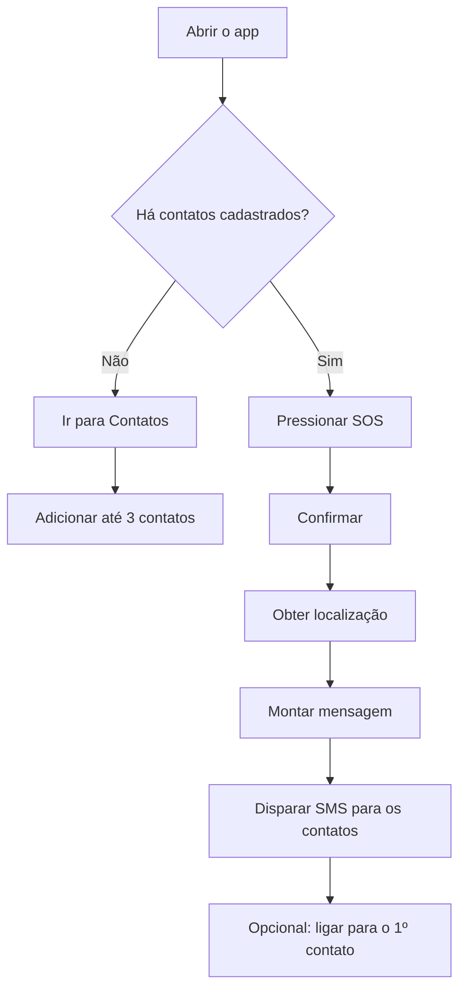

# SOS Mulher

|  |
| :---: |

App de emergência com **botão SOS**, **contatos de confiança** e **envio de localização**, pensado para facilitar um pedido de ajuda rápido.

## A ideia

**Problema:** em situações de risco, cada segundo importa — e nem sempre dá para abrir apps, digitar mensagens ou explicar onde você está.

**Proposta:** um fluxo curto e direto para acionar ajuda com:

- 1 toque no **SOS**
- mensagem pronta + **link da localização**
- envio para **contatos de confiança**
- opção de **ligação rápida**

> Este é o nosso **primeiro Projeto Integrador** do curso de **Bacharel em Tecnologia da Informação (BTI)** na **[Univesp](https://univesp.br/)**.

## Funcionalidades (resumo)

| O que faz | O que entrega |
| --- | --- |
| Botão SOS (com confirmação) | Ação rápida + redução de toque acidental |
| Contatos de confiança (até 3) | Cadastro simples + gestão local |
| Localização no SOS | Link de mapa para facilitar encontrar a pessoa |
| Envio de SMS / ligação | Comunicação direta com quem vai ajudar |
| Persistência local | Contatos continuam salvos no aparelho |

## Como funciona (visão rápida)

## Componentes do projeto

| Componente | Papel no projeto |
| --- | --- |
| App (telas e navegação) | Onde a pessoa aciona o SOS e gerencia contatos |
| Contatos (armazenamento local) | Mantém os contatos salvos no próprio dispositivo |
| SOS (mensagem + localização) | Gera a mensagem de emergência com link de localização |
| API / OAuth (opcional) | Integrações e autenticação, quando configuradas |

## Screenshots

| Emergência | Contatos |
| --- | --- |
|  |  |

## Tecnologias

- **App:** Expo / React Native + Expo Router
- **UI:** NativeWind (Tailwind)
- **Dados locais:** AsyncStorage
- **API (opcional):** Express + tRPC v11
- **Testes:** Vitest

## Links

- Execução (guia completo): [COMO_RODAR.md](COMO_RODAR.md)
