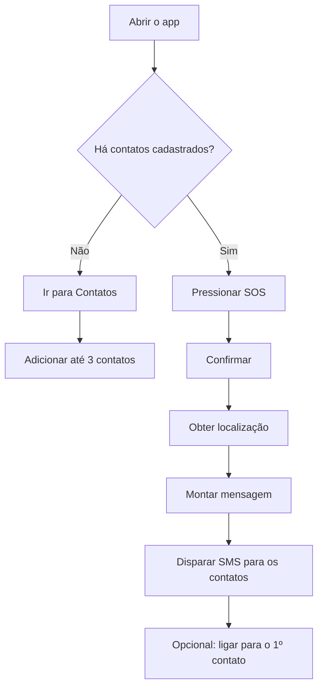

# SOS Mulher

|  |
| :---: |

App de emergência com **botão SOS**, **contatos de confiança** e **envio de localização** para facilitar um pedido de ajuda rápido.

Este é o nosso **primeiro Projeto Integrador** do curso de **Bacharel em Técnologia da Informação (BTI)** na **[Univesp](https://univesp.br/)**.

- Frontend: **Expo / React Native** (com Expo Router)
- Backend (opcional): **Express + tRPC**
- Persistência local: **AsyncStorage** (contatos)

> Guia completo de execução: veja `COMO_RODAR.md`.

## Funcionalidades

| O que faz | Onde funciona melhor | Observações |
| --- | --- | --- |
| Botão SOS (com confirmação) | Celular | Feedback visual + fluxo de confirmação |
| Contatos de confiança (até 3) | Celular/Web | Adicionar/editar/remover |
| Localização (link) no SOS | Celular | Depende de permissão de localização |
| Envio de SMS | Celular | No web pode ser limitado pelo navegador |
| Chamada rápida | Celular | No web pode ser limitado |
| Persistência local | Celular/Web | Contatos ficam salvos localmente |

## Fluxo (visão rápida)



## Screenshots

> Se você quiser, eu também posso gerar screenshots reais depois que você rodar o app e me mandar 2 prints (Home e Contatos).

| Home (SOS) | Contatos |
| --- | --- |
| *(adicione aqui)* | *(adicione aqui)* |

## Stack

- Expo ~54 / React Native
- TypeScript
- Expo Router
- NativeWind (Tailwind)
- tRPC v11 + React Query
- Express (API)
- Vitest (testes)

## Como rodar (rápido)

### 1) Instalar dependências

```bash
pnpm install
```

### 2) Configurar variáveis (opcional)

```bash
# Windows (PowerShell)
Copy-Item .env.example .env

# macOS/Linux
cp .env.example .env
```

> Para testar no celular com Expo Go falando com o backend do seu PC, ajuste `EXPO_PUBLIC_API_BASE_URL` no `.env`.

### 3) Subir o projeto

```bash
pnpm dev
```

Isso inicia:

- o backend (porta 3000 ou próxima livre)
- o Expo (web) na porta 8081 ou próxima livre

### Testar no celular (Expo Go)

1. Garanta que PC e celular estão na **mesma rede**.
2. Suba o Expo (mostra QR Code no terminal):

```bash
pnpm exec expo start
```

1. No Expo Go, escaneie o QR.

Se o celular não conectar via rede local, tente:

```bash
pnpm exec expo start --tunnel
```

## Scripts

- `pnpm dev` — dev server completo (API + Expo web)
- `pnpm dev:server` — apenas API (Express + tRPC)
- `pnpm test` — roda os testes (Vitest)
- `pnpm check` — TypeScript (noEmit)
- `pnpm lint` — lint (Expo)
- `pnpm format` — Prettier

## Estrutura

- `app/` — telas e navegação (Expo Router)
- `components/` — componentes reutilizáveis
- `hooks/` — hooks (tema, auth, localização)
- `lib/` — contextos e utilitários (inclui tRPC client)
- `server/` — API (Express + tRPC)
- `drizzle/` — schema/migrations (quando usando DB)
- `tests/` — testes unitários (Vitest)

## Variáveis de ambiente

Veja o arquivo `.env.example` para a lista de variáveis.

Destaques:

- `JWT_SECRET` — obrigatório para auth de sessão
- `PORT` — porta preferida do backend
- `EXPO_PUBLIC_API_BASE_URL` — necessário principalmente para **rodar no celular** apontando para o backend do PC
- `OAUTH_SERVER_URL`, `VITE_APP_ID`, `VITE_OAUTH_PORTAL_URL` — apenas se for usar login OAuth

## Notas

- No **web**, algumas funcionalidades podem ser limitadas (ex.: SMS/telefone) — no device elas funcionam melhor.
- O backend é opcional dependendo do que você quer testar (contatos usam AsyncStorage).
